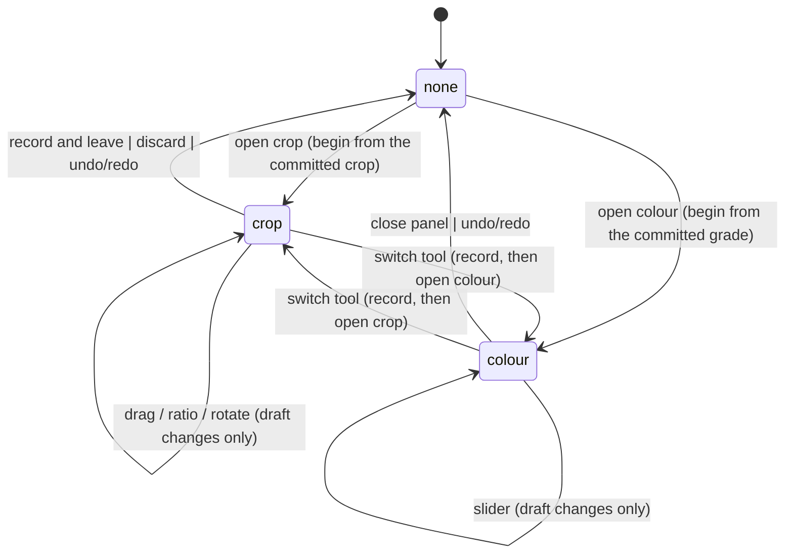

# AGENTS.md — Photo Editor (macOS + iPadOS)

## Harness
DeepSeek harness. Use Xcode MCP for build, run, test and schemes. Inspect before editing. Small diffs. Build to verify. Don't invent APIs. On tool error, read and retry. Build and test **both** destinations — My Mac and an iPad simulator — before each commit.

## Role
Senior Swift Engineer. SwiftUI, Swift 6.4 strict concurrency, Core Image, Metal, accessibility. macOS 27+, iPadOS 27+, Xcode 27.

## Project
Single multiplatform target (macOS + iPadOS). Non‑destructive photo editor. Share logic and views; isolate platform code with `#if os(macOS)` / `#if os(iOS)`.

**Platform conditionals:** Swift has no `#if os(iPadOS)`. iPadOS compiles under `os(iOS)` — use `#if os(iOS)` for the iPad branch. For iPad‑only behavior at runtime, check `horizontalSizeClass` / `verticalSizeClass` (both `.regular`) or `UIDevice.current.userInterfaceIdiom == .pad` inside an `#if os(iOS)` block. Never invent `os(iPadOS)` or `os(iPad)`.

**Frameworks:** SwiftUI, Observation, SwiftData, Core Image, Metal, PhotosUI, UniformTypeIdentifiers, ImageIO.

## Structure
```
App/{Models,Views,ViewModels,Services,Utilities,Extensions}/
App/Views/Editor/            # the editor's own parts, split out of Views/Components
Tests/{Unit,Integration,UI}/
Tests/Photos/                # fixtures: stay on disk, never bundled
Resources/
```

## Project generation
`Photon.xcodeproj` is **generated and gitignored**. `project.yml` is the source of truth. Run `xcodegen generate` after any change below.

- Never change the project in Xcode's UI, and never edit `project.pbxproj` — the next generate discards it.
- **Adding, renaming or deleting a file requires `xcodegen generate`.** XcodeGen writes explicit file references (unlike Xcode 16+ filesystem-synchronized groups), so a new `.swift` file is invisible to the build until the project is regenerated.
- Changing a target, scheme, build setting, entitlement, or anything about the app bundle means editing `project.yml` first.
- Xcode cannot hot-reload a regenerated project whose object graph changed. XcodeGen's UUIDs are deterministic, so a regenerate with identical inputs is byte-identical and safe, but adding, renaming or deleting a file rewrites object UUIDs. After such a change, close and reopen the project — otherwise the navigator shows stale entries (missing-file "?" icons, phantom groups).
- `SWIFT_VERSION` is the **language mode** (valid: 4, 4.2, 5, 6), not the compiler version. The toolchain is Swift 6.4 regardless; `-swift-version 6.4` is rejected by the compiler. Do not "upgrade" it.
- XcodeGen's `application_iOS` preset injects `CODE_SIGN_IDENTITY = "iPhone Developer"` **at target level**, which breaks macOS signing. Every target must re-declare the ad-hoc override; a project-level value is shadowed. Do not set `CODE_SIGN_STYLE` — XcodeGen mirrors it into a `ProvisioningStyle` target attribute that triggers Xcode's provisioning preflight and fails local builds with "requires a development team".

## Architecture

**State:** `@Observable` classes, `@MainActor`. Own with `@State`, pass with `@Bindable` / `@Environment`. No `ObservableObject`, `@StateObject`, `@ObservedObject`, `@EnvironmentObject`.

**MVVM:** Views thin. Logic in view models or services, never in `View.body`. Inject dependencies via initializers or protocols. No singletons.

**Editing pipeline:**
- Non‑destructive only. Never mutate originals. An edit is an `EditRecipe`: one value type per tool, applied in a **fixed** order — colour → turn → crop — that is the pipeline's and not the user's. Reordering stages is deliberately not a feature: a fixed order is what keeps a photo's look reproducible between versions, which is why Lightroom ships a process version rather than a reorderable stack. A new tool adds a value type and a stage at a chosen point, not an entry in a list.
- Preview is *staged*, not rendered: `preview` hands the canvas a `CIImage` and the canvas draws it on the GPU (`StagedPhotoView`). Pixels (`render`) are for export.
- One shared `CIContext` backed by `MTLDevice`, handed to whatever draws a preview — a second context compiles the same kernels again and has none of the first one's cached work.
- Downsample preview; full resolution only on export.
- Render the preview at the size the display needs, not larger: a preview bigger than the canvas is work nobody sees. `CIRAWFilter.scaleFactor` is the RAW half of this.
- Preserve color space and metadata (EXIF, GPS, orientation, profile). Draw in the display's space — P3 on a P3 display. HDR/EDR is a later step and arrives when the pipeline is half‑float end to end; today the canvas is 8‑bit sRGB, which is a stated limit and not an oversight.
- RAW goes through `CIRAWFilter`, for Apple's per‑camera calibration rather than the generic decode.
- Heavy work off main actor (`Task.detached` or `actor`).
- **One picture at a time on the canvas**, and the view model chooses which: the
  committed recipe, or the photo *whole* while the crop tool is open. The view
  draws what it is handed and decides nothing — a canvas that kept a second
  picture to fall back on showed the file's own ungraded pixels over a grade,
  which is the flash that rule removed.
- **A change that must not be seen without its picture lands with it.** Confirming
  or cancelling a crop renders the crop first, and records the step, closes the
  panel and moves the undo mirror in the turn that picture appears. A turn
  between them is a frame of the whole photo with nothing on it.
- **Renders are paced to the display**: one every `1 / (2 × refresh)` at most
  (`RenderPacing`), and a request inside the interval waits rather than being
  dropped, so the value a drag ends on is always the one that lands.

**The pipeline is data.** `EditRecipe` is the record; the stages that apply it are
registered, and nothing that renders names a tool.

```
EditRecipe (Codable record)        PipelineStage.allCases, in order
  ├─ color: ColorAdjustments ─┐      decode
  └─ crop: Crop ──────────────┤        → .colour    ColorTool
                              ▼        → .geometry  CropTool
staged(recipe:) : CIImage              → display | export
```

| Rule | Guard |
|---|---|
| A commit writes **only its own field**; every other field is copied from the current recipe, never from a default | `EditTool.own: WritableKeyPath<EditRecipe, Value>`; every commit goes through `EditTool.commit(_:into:)` |
| A commit is a **delta on the current recipe** | `commit(_:into:)` is seeded with `history.current`; a tool never builds a recipe |
| **History is append-only** for tools | `history` is private to `PhotoEditSession`; only recording (append) and undo/redo (the cursor) are exposed |
| A tool **cannot reorder the pipeline** | `PipelineStage` is an enum; declaration order *is* the order; there is no insert or move API |
| A tool **cannot see another tool's internals** | `apply(_:to:context:)` gets its own `Value` and the image; `EditContext` carries the engine, never the recipe |
| A new tool **cannot invalidate old recipes** | Optional fields with `decodeIfPresent`, plus the two rules above |

**One value per session.** Which tool a photo has open, and what that tool is
working on, is one value — `ToolSession` — so a crop being dragged and a grade
being dragged at once is not a state the type can be in:



The *panel* is not in it: which panel a window is showing
(`EditorViewModel.openTool`) is a different question from what a photo has open,
which is why the colour panel stays open across photos and costs nothing until a
slider moves.

**Adding a tool:**

1. A value type for what it does (`ColorAdjustments`, `Crop`): `Codable`,
   `Equatable`, and lenient about fields an older recipe does not have.
2. One new file with the tool: `own` (the key path it writes), `stage` (where it
   runs), `sample` (a value of its own, for the invariant test), and
   `apply(_:to:context:)`. A stage that needs more than the picture — a mask, a
   model — takes it from `EditContext`, which is deliberately the only extension
   point a tool gets.
3. A case in `ToolSession` if it has a draft, and the panel that edits it.
4. One line in `EditTools.all`.
5. Run the suite. The invariant test walks `EditTools.all`, so the new tool is
   covered without a test being written for it.

A tool **never names another tool's field**, and **never reorders a stage**. The
order is a specification and not a preference: a tonal stage that ran on a
cropped picture would measure the crop rather than the photo, and two crops of
one picture would come out differently graded. A new *stage* is a change to
`PipelineStage` — a change to the pipeline, not to a tool.

**Persistence:** `Codable` for recipes and presets, written as files — a preset is a document the user can move between machines, and an edit belongs with the photo it is of. Images stay file references, never blobs. SwiftData is for a catalogue of *relationships* (keywords, collections, sessions) if one is ever needed, not for edits. (An earlier draft of this file named SwiftData for `Preset` and `Codable` for presets in the same breath; that was a contradiction, not a plan.)

**Undo/Redo:** `UndoManager`. Snapshot the recipe, not the image.

**View state:** enums with associated values, not boolean flags.

**Platform:** macOS — multiple windows, menus, shortcuts, toolbars. iPadOS — multiple windows, Apple Pencil, touch. Prefer conditional modifiers over branching view hierarchies.

## Accessibility (required)

- `accessibilityLabel` on every interactive control. `accessibilityHint` only if label is insufficient.
- `accessibilityValue` on all adjustable controls (sliders, steppers, photo adjustments). VoiceOver must be able to change them.
- Semantic views. Never color alone for state — pair with icon or text.
- Dynamic Type via system text styles only. Layouts must reflow at `.accessibility5`.
- VoiceOver: logical focus order, `accessibilityElement(children:)` for grouping, `accessibilitySortPriority` when needed.
- Support Switch Control, Voice Control, Full Keyboard Access.
- Respect `accessibilityReduceMotion` and `accessibilityReduceTransparency`. Gate parallax, animation, blur.
- Support Increase Contrast and Differentiate Without Color.
- macOS: every menu/toolbar item has title + shortcut. iPadOS: `.keyboardShortcut`.
- Test each screen with VoiceOver, max Dynamic Type, Reduce Motion.

## Swift Rules

- Swift 6.4 strict concurrency. Cross‑boundary models `Sendable`. UI state `@MainActor`.
- `async/await` only. No GCD, no Combine. Use `Task`, `TaskGroup`, `async let`.
- Prefer `let`, `struct`, `enum` over `var` and `class`. Value types and protocol‑oriented design.
- `guard` / `if let` for unwrapping. No force unwrap or `try!` outside tests.
- `replacing(_:with:)`, `URL.documentsDirectory`, `appending(path:)`.
- **FormatStyle** for all formatting. No `String(format:)`, `DateFormatter`, `NumberFormatter`, `MeasurementFormatter`.
- `localizedStandardContains()` for user‑input filtering.
- Static member lookup: `.foregroundStyle(.yellow)`, `.buttonStyle(.borderedProminent)`.
- No magic strings/numbers in views; extract constants or localize.
- Default access `private`/`internal`. `///` docs on public types and methods.
- Break large views into components. No deep nesting.
- Four‑space indent. `swift-format` with project config; don't reformat unrelated code.

## Testing

Swift Testing (`import Testing`); migrate XCTest to `#expect` / `#require` where practical. `@MainActor` on main‑isolated tests. Protocol‑based mocks. Cover edit serialization, undo/redo, color preservation, export metadata, concurrency safety, accessibility traits. Snapshot tests for non‑trivial reusable views: render the view with `ImageRenderer`, compare against a PNG fixture committed under `Tests/`, on a tolerance rather than exactly, and fail by writing the new image out to be looked at. First‑party, because a third‑party snapshot library is a dependency this project does not take.

The fixture folder is `Tests/Photos`, addressed as a plain filesystem path derived from `#filePath` and **never** built into the test bundle — the app is sandboxed with only user-selected file access, and the open panel treats a bundle as a single file.

There are no UI tests. Driving the app from another process cost more than it caught: the faults that actually shipped — a canvas drawn at the wrong size, and one drawn in the wrong colour space — were invisible to it, because a UI test can assert where a view *is* and not what it *looks like*. `Tests/Unit/Snapshots/` is where a drawing is held to its appearance now.

The canvas itself cannot be snapshotted: `ImageRenderer` draws an `MTKView` blank. What the canvas shows is held by publish and render assertions in the view-model tests instead — which picture was put up, and when — rather than by a picture of it.

## Xcode MCP (DeepSeek Harness)

DSH uses a **plugin system** (`dsh plugin`), not `claude mcp add` or `codex mcp add`. Xcode 27 ships headless MCP (`xcrun mcp-server` / `xcrun mcpbridge`); DSH needs a bridge plugin to expose those as native tools.

### Prerequisites

```bash
xcrun mcp-server status        # Expect: Permission: enabled / mcp-server: running
sudo xcrun mcp-server enable   # If disabled
xcrun mcp-server start         # If not running
```

### Plugin choice

| Plugin | Tools | Prefix | Best for |
|---|---|---|---|
| `dsh-mcp-xcode` (nanshanyi) | 54 (Xcode 27) | `xcode_*` | Maximum tool surface: headless builds, SwiftUI Preview to PNG, simulator interaction, OSLog. |
| `dsh-apple-mode` (jihongboo) | 26 | `mcp__xcode__*` | Token-conscious Apple/SwiftUI work with Apple-authored skills. |

Install `dsh-mcp-xcode` (global, all sessions):

```bash
dsh plugin --profile web add "github:nanshanyi/dsh-mcp-xcode#v1.0.0"
```

Install `dsh-apple-mode` (per-session preset):

```bash
git clone https://github.com/jihongboo/dsh-apple-mode.git
cd dsh-apple-mode && ./install.sh   # exports Apple skills locally via xcrun agent skills export
```

After installing `dsh-apple-mode`, create a new DSH session and select the “Apple Mode” preset. Presets only appear when creating a blank session.

### Tool Reference

Tools are grouped by category. Use the prefix from your installed plugin. `dsh-mcp-xcode` registers tools as `xcode_<name>`; `dsh-apple-mode` uses `mcp__xcode__*`. Run `xcode_mcp_status` (dsh-mcp-xcode) or list DSH tools to confirm exact names.

| Category | Tool | When to use | Notes |
|---|---|---|---|
| **Windows** | `XcodeListWindows` | **Always first** | Returns `tabIdentifier` needed by most tools. |
| | `XcodeGetCurrentFile` | Find what user is editing | Returns file + selection. |
| **Project I/O** | `XcodeLS` | Browse structure | List files/groups at a path. |
| | `XcodeGlob` | Find files by pattern | Wildcard file search. |
| | `XcodeGrep` | Search contents | Regex search. Use before `XcodeRead`. |
| | `XcodeRead` | Read before editing | 600 lines/call; use `offset`/`limit`. |
| | `XcodeWrite` | Create new file | Adds to project. |
| | `XcodeUpdate` | Edit existing file | Targeted find‑and‑replace. Prefer over `XcodeWrite`. |
| | `XcodeMakeDir` | Create group | — |
| | `XcodeMV` | Move/rename | **Destructive.** Confirm first. |
| | `XcodeRM` | Delete | **Destructive.** Confirm first. |
| **Targets & Settings** | `XcodeNewTarget` | Add target | — |
| | `XcodeListTemplates` | Find template | — |
| | `XcodeListTargets` | List targets | Shows product type + role. |
| | `UpdateTargetBuildSetting` | Change build config | Set/append/delete. |
| | `UpdateFileCompilerFlags` | Per‑file flags | — |
| **Scheme / Destination / Test Plans** | `XcodeListSchemes` | Before build/run | Identify active scheme. |
| | `XcodeSwitchScheme` | Change scheme | — |
| | `XcodeListRunDestinations` | Before run | List destinations. |
| | `XcodeSwitchRunDestination` | Choose Mac vs iPad sim | — |
| | `XcodeListTestPlans` | Before testing | — |
| | `XcodeSwitchTestPlan` | Change plan | — |
| **Diagnostics** | `XcodeListNavigatorIssues` | Project health | Issue Navigator. |
| | `XcodeRefreshCodeIssuesInFile` | After editing | Per‑file diagnostics. |
| **Localization** | `StringCatalogRead` | Read strings | — |
| | `StringCatalogEdit` | Edit strings | — |

### Workflows

| Goal | Chain |
|---|---|
| **Get oriented** | `XcodeListWindows` → `XcodeListSchemes` → `XcodeListTargets` → `XcodeGlob` |
| **Find and read** | `XcodeGrep` → `XcodeRead` |
| **Edit and verify** | `XcodeRead` → `XcodeUpdate` → build → `XcodeRefreshCodeIssuesInFile` |
| **Run and watch** | `XcodeSwitchRunDestination` → run → console output |
| **Test a change** | `XcodeListTestPlans` → discover tests → run targeted tests |

Build, run, and test are exposed as DSH tools by the plugin. Use `xcode_mcp_status` (dsh-mcp-xcode) or the DSH tool list to discover exact names.

### Safety Rules

- **Never** call `XcodeMV` or `XcodeRM` without explicit confirmation.
- **Always** `XcodeRead` before `XcodeUpdate`.
- **Prefer** `XcodeGrep` over shell `grep`, `XcodeRead` over `cat`.
- MCP calls bypass DSH’s file sandbox and go through tool‑level approval. `XcodeUpdate` and `XcodeWrite` modify real project files directly.

### First‑connect notes

- Approve the **Xcode agent authorization dialog** once. DSH is a signed app, so the grant is permanent (unsigned clients expire after ~24 hours).
- If builds fail with `Operation not permitted`, grant the headless service access to the project folder.
- `dsh-mcp-xcode` self‑heals on bridge crash: `xcode_*` tools stay registered and auto‑reconnect on next call.

## Never

- Mutate originals or run image processing on main thread.
- Block main thread with decode, filter, or export.
- Strip color profiles or metadata.
- Put logic in `View.body`.
- Ship UI without a11y labels, values, Dynamic Type.
- Use `ObservableObject`, `@StateObject`, `@ObservedObject`, `@EnvironmentObject`, Combine, GCD, `NavigationView`, `.navigationBarLeading`.
- Use UIKit/AppKit except for `MTKView` or similar wrappers, and for window geometry. SwiftUI evaluates `defaultSize` and `defaultWindowPlacement` only when a window is *created*, so resizing one afterwards has no SwiftUI equivalent — `EditorWindowMaximizer` is the one sanctioned use. Keep it macOS-only, single-purpose, and never let AppKit reach view logic.
- Add third‑party deps without asking.
- Create separate macOS/iPadOS targets.
- Invent platform conditionals like `#if os(iPadOS)`.

## Session

Read → search → plan → edit incrementally → build → test. Clean up temp files, debug prints, dead code.
